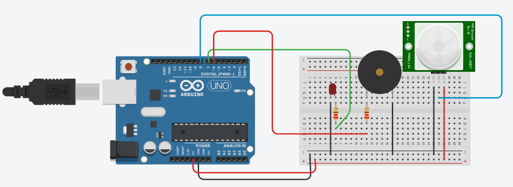

# Documento de Visão do Projeto "Campainha de Mercadinho"

Este documento apresenta uma solução de software para o projeto *Campainha de Mercadinho*, 
apresentando os problemas a serem solucionados, as necessidades dos principais envolvidos, o alcance do projeto e as funcionalidades esperadas.

## Objetivos

* Criar uma campainha (ou alarme), que é acionado através de um sensor de movimentos, que emita um aviso sonoro para avisar um vendedor de uma loja (ou mercado de pequeno porte) que um novo cliente chegou.

## Problema

* Descrição do problema: Falta ou mal atendimento de clientes, por conta de o vendedor não perceber que um novo cliente chegou ao estabelecimento
* Quem é afetado pelo problema: Os vendedores e donos de pequenos estabelecimentos
* Impacto no negócio: Médio
* Benefícios de uma boa solução: Melhor e mais rápido atendimento de clientes

## Definições, abreviações e outros termos do domínio do problema

* Não há

## Integração com outros sistemas

* Node-Red
* Sistema de armazenamento de dados (SGBD)
 
## Interessados

* Clientes de pequenos estabelecimentos
* Vendedores de pequenos estabelecimentos
* Administradores e donos de pequenos estabelecimentos

## Usuários

* Vendedores de pequenos estabelecimentos

## Funcionalidades do produto

* Avisar ao vendedor da entrada de um novo cliente no estabelecimento, através de um sinal sonoro que é emitido no momento que o sensor de presença detecta um movimento na entrada do estabelecimento

## Restrições do projeto

* Não há

## Protótipos

### Protótipos para funcionalidade 1

Fonte: Circuito criado através do Tinkercad **Enterprise Architect**.
