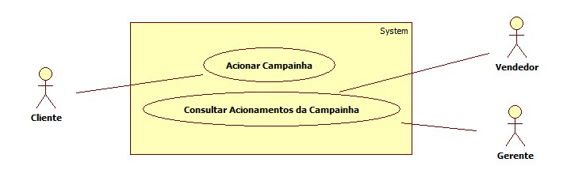

# Casos de uso

## 1. Diagrama de casos de uso

**Instruções do professor**: Insira abaixo o diagrama com os casos de uso do seu sistema. A imagem abaixo é somente um exemplo.

## 2. Especificação dos casos de uso

### 2.1. Caso de uso **Acionar Campainha**

| Campo          | Informação        |
|---|---|
| Identificador: | UC01              |
| Nome:          | Acionar Campainha |
| Atores:        | Cliente |
| Sumário:       | Aciona a campainha ao entrar no estabelecimento |

| Fluxo Principal |
|---|
| 1) Ao chegar ao estabelecimento, a campainha é acionada |
| 2) O sistema registra o acionamento e informa que a operação foi bem-sucedida. |

### 2.2. Caso de uso **Consultar Acionamentos da Campainha**

| Campo          | Informação        |
|---|---|
| Identificador: | UC02            |
| Nome:          | Consultar Acionamentos da Campainha |
| Atores:        | Vendedor, Gerente |
| Sumário:       | Consulta as datas e horários em que a campainha foi acionada |

| Fluxo Principal |
|---|
| 1) O vendedor ou gerente, realizam o login no sistema |
| 2) O sistema lista todas as datas e os horários em que a campainha foi acionada |

