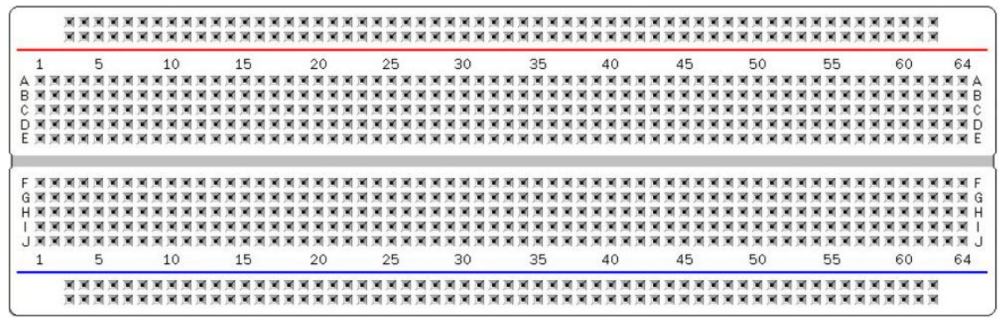
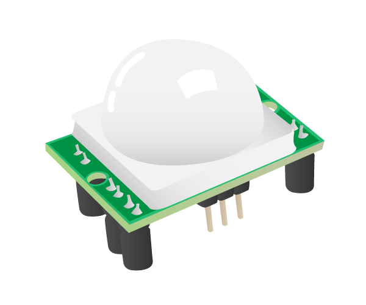
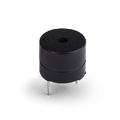

# Descriçao do Hardware

Deve conter:

1) Lista de Peças (descrição e imagens, quando disponíveis): 
•	Arduino Uno R3 
 
•	Protoboard 830 pontos branco 

•	Sensor de Presença e Movimento PIR 
 
•	Buzzer 5V 
 
•	Led Azul 

2) Desenho Tinkercad ou Fritzing

3) Esquema eletrônico

4) Materiais para confecção de caixas e consoles (ou arquivos para impressão 3D)
•	Não haverá impressão 3D 
