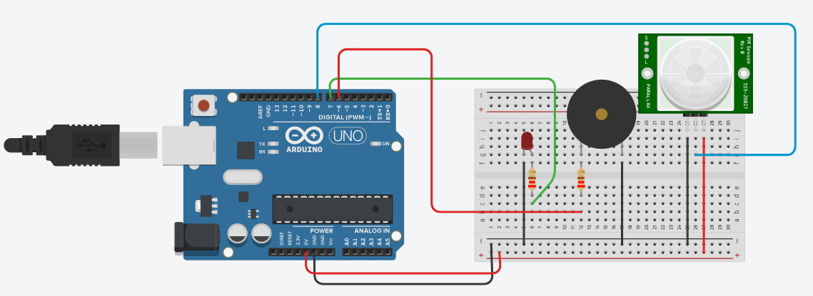

# Descriçao do Hardware

Deve conter:

1) Lista de Peças (descrição e imagens, quando disponíveis):
•	Arduino Uno R3
•	Protoboard 830 pontos branco
•	Sensor de Presença e Movimento PIR
•	Buzzer 5V
•	Led Azul

2) Desenho Tinkercad ou Fritzing

3) Esquema eletrônico

4) Materiais para confecção de caixas e consoles (ou arquivos para impressão 3D)
